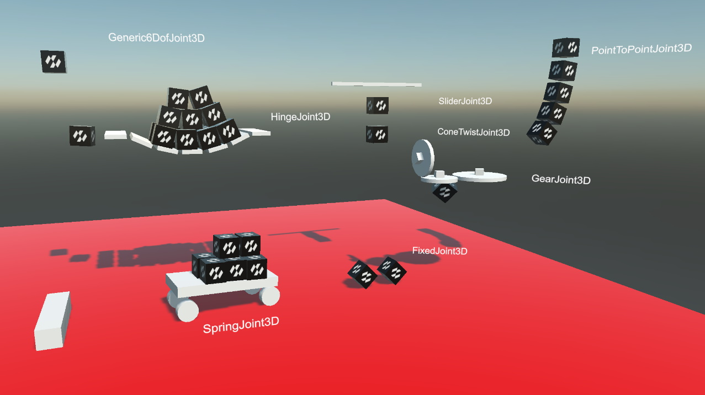
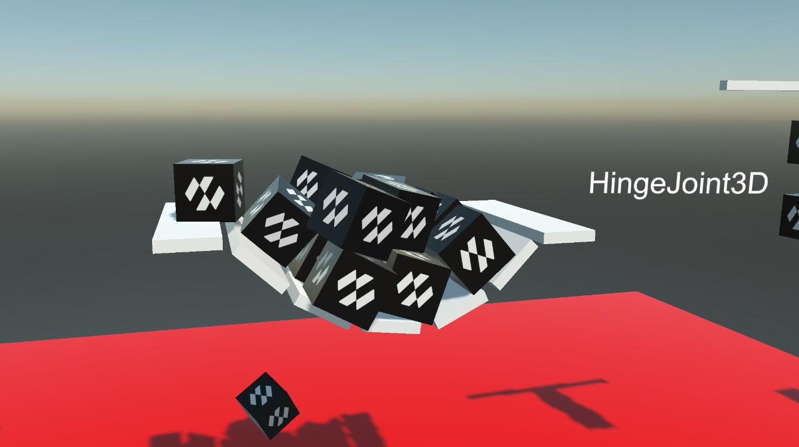

# Physics Joints Sample

This sample shows the different types of physics joints that you can use Evergine to enhance your simulations.

## Build and Run
- Required Visual Studio 2022 with .NET6 support

### How to use

 * **Mouse Drag:** Move physics bodies.
  
----
Powered by **[Evergine](https://evergine.com)**

LET'S CONNECT!

- [Youtube](https://www.youtube.com/channel/UCpA-X92rxM0OuywdVcir9mA)
- [Twitter](https://twitter.com/EvergineTeam)
- [News](https://evergine.com/news/)
